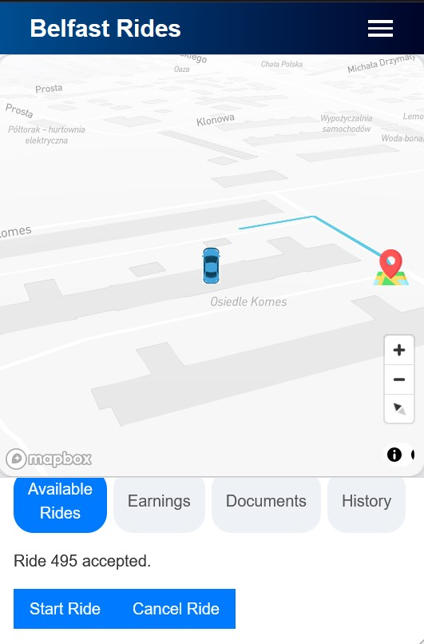

# Belfast Rides 🛺

Belfast Rides is a full-stack taxi booking web application designed with multi-role functionality for riders, drivers, and administrators. The system supports user-friendly booking, real-time ride management, admin oversight, and mobile-responsive dashboards.

The app was developed as a practical project to simulate a scalable white-label booking platform, with an emphasis on clean modular architecture, robust role-based routing, and full deployment across modern cloud services.

---

## 🌐 Live Demo

- **Frontend (React):** [belfastrides.netlify.app](https://belfastrides.netlify.app)
- **Backend (Node/Express):** [belfast-rides.onrender.com](https://belfast-rides.onrender.com)  
  *(some routes protected by auth, limited access in demo mode)*

---

## 🧠 Features

### 👤 Rider Dashboard
- Book taxi rides with real-time validation
- View ride history and completed trips
- Upload and manage profile picture
- Rate completed rides
- Chat with assigned driver

### 🚗 Driver Dashboard
- Accept or decline available rides
- View current and previous weekly earnings
- Upload multiple verification documents
- Receive and complete rides

### 🛠️ Admin Dashboard
- Search and view rider and driver profiles
- Manually assign or cancel rides
- Verify driver-uploaded documents
- Monitor system via live database-linked actions

---

## 🧰 Tech Stack

**Frontend:** React, React Router, Bootstrap  
**Backend:** Node.js, Express, REST APIs  
**Database:** MySQL (hosted via Railway)  
**Deployment:** Netlify (frontend), Render (backend)  
**Testing:** REST Client `.http` file testing in VS Code for live API responses and DB state verification

---

## 🚀 Architecture

- React frontend with route-based views for each user role
- Express controllers and routes for modular backend logic
- MySQL relational schema managing users, rides, and verification status
- Stateless API design with RESTful endpoints and frontend-driven flow
- Separate hosting for frontend/backend for full-stack deployment flexibility

---

## 📸 App Screenshots

### 👤 Rider Dashboard

### 🧾 Ride Status Flow

### 💸 Driver Dashboard

### 🛠️ Admin Dashboard

## 📁 Folder Structure

/screenshots → App screenshots for README
/src → React components and routes
/controllers → Backend logic and business rules
/routes → Express routing setup
/public → Static frontend assets

---

## ⚙️ Development Notes

Testing was performed using VS Code's REST Client via `.http` files for backend API interaction. Responses were validated both in JSON output and directly in the MySQL database. Frontend user flow was tested across desktop and mobile views.

---

## 👤 Author

Michael Wilson  
[GitHub](https://github.com/mwilson35)  
Open to full-stack or frontend roles 

